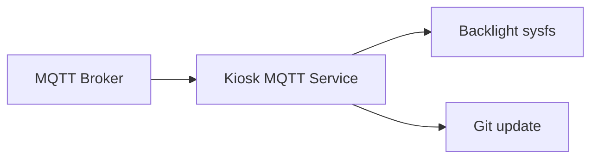

# 🖥️ Ubuntu Kiosk MQTT

  

Remote-control Ubuntu kiosk screens with MQTT, including backlight brightness, display power, and update triggers.
Designed for simple, headless management of kiosk devices from a central broker.

## ✨ Feature Highlights

- MQTT-driven control for brightness, display power, and status updates.
- Systemd-managed service for reliable startup and restarts.
- Backlight brightness control via Linux sysfs.
- Remote update triggers that pull the latest git changes.
- Structured state/error reporting over MQTT topics.



## 🧭 Table of Contents

- [Installation](#installation)
- [Configuration](#configuration)
- [Quick Start](#quick-start)
- [MQTT Topics](#mqtt-topics)
- [Systemd Service](#systemd-service)
- [Troubleshooting](#troubleshooting)
- [Security](#security)

## ✅ Requirements

Prerequisites to run and manage the kiosk service.

- Ubuntu with `python3` available
- MQTT broker reachable from the device
- Backlight sysfs support (e.g. `/sys/class/backlight/...`)
- Python dependency: `paho-mqtt`

## 📦 Installation

Set up the repo, dependencies, and service files on the kiosk host.

1. **Clone the repo to the target path** (the systemd unit assumes `/opt/kiosk-mqtt`):

   Clone the repository:

   ```bash
   sudo mkdir -p /opt/kiosk-mqtt
   sudo chown "$USER":"$USER" /opt/kiosk-mqtt
   git clone https://github.com/2wenty2wo/ubuntu-kiosk-mqtt /opt/kiosk-mqtt
   ```

2. **Install Python dependency**:

   Install dependencies:

   ```bash
   sudo apt update
   sudo apt install python3-paho-mqtt
   ```

3. **Configure the systemd service**:

   Review `systemd/kiosk-mqtt.service` and update the `Environment=` lines to match
   your MQTT broker, device ID, topic prefix, and backlight name.

4. **Install and enable the service**:

   Enable the service:

   ```bash
   sudo cp systemd/kiosk-mqtt.service /etc/systemd/system/kiosk-mqtt.service
   sudo systemctl daemon-reload
   sudo systemctl enable --now kiosk-mqtt.service
   ```

5. **Verify status**:

   Check the service status:

   ```bash
   sudo systemctl status kiosk-mqtt.service
   ```

## 🚀 Quick Start

Validate connectivity with a minimal publish test.

1. Ensure the service is running:

   Check the service status:

   ```bash
   sudo systemctl status kiosk-mqtt.service
   ```

2. Publish a brightness change to confirm connectivity:

   Publish a test brightness command:

   ```bash
   mosquitto_pub -h "$MQTT_HOST" -t "kiosk/<DEVICE_ID>/cmd/brightness" -m "50"
   ```

## 🛠️ Systemd Service

Common commands for controlling the kiosk service.

Service control commands:

```bash
sudo systemctl start kiosk-mqtt.service
sudo systemctl stop kiosk-mqtt.service
sudo systemctl restart kiosk-mqtt.service
```

## ⚙️ Configuration

Define runtime settings via environment variables.

All configuration is via environment variables (set in the systemd unit):

- `MQTT_HOST` / `MQTT_PORT` / `MQTT_USER` / `MQTT_PASS`
- `DEVICE_ID` (used in topic prefix)
- `TOPIC_PREFIX` (default `kiosk/<DEVICE_ID>`)
- `BACKLIGHT_NAME` (e.g. `intel_backlight`)
- `REPO_DIR`, `SERVICE_NAME`, `ALLOWED_BRANCH`

### 🔐 Systemd drop-in for secrets (recommended)

Store credentials locally without editing tracked files.

To keep MQTT passwords out of the repo and avoid re-entering them after `git pull`,
use a systemd drop-in override on the kiosk host:

Open a systemd editor:

```bash
sudo systemctl edit kiosk-mqtt.service
Add the override content:

```

Add the following content:

```
[Service]
Environment=MQTT_PASS=your_password_here
```

Then reload and restart the service:

Reload and restart:

```bash
sudo systemctl daemon-reload
sudo systemctl restart kiosk-mqtt.service
```

This creates `/etc/systemd/system/kiosk-mqtt.service.d/override.conf`, which is
local to the machine and won’t be overwritten by `git pull`.

## 📡 MQTT Topics

Published and subscribed topic names and payload expectations.

Published:

- `<TOPIC_PREFIX>/state` (JSON with device, brightness, display, git info)
- `<TOPIC_PREFIX>/error` (JSON error messages)

Subscribed:

- `<TOPIC_PREFIX>/cmd/brightness` (0-100 percent as plain numeric payload, or JSON `{ "brightness": 200 }` for 0-255 values)
- `<TOPIC_PREFIX>/cmd/display` (`ON`/`OFF`)
- `<TOPIC_PREFIX>/cmd/update` (`pull`, `update`, `1`, `true`)
- `<TOPIC_PREFIX>/cmd/version` (any payload publishes state)

## 🧰 Troubleshooting

Quick checks for common setup and runtime issues.

- **No MQTT messages?** Confirm the broker hostname, credentials, and topic prefix in
  `systemd/kiosk-mqtt.service`, then restart the service.
- **Backlight errors?** Double-check `BACKLIGHT_NAME` matches the directory under
  `/sys/class/backlight`.
- **Service not starting?** Review logs with:

  Review logs:

  ```bash
  sudo journalctl -u kiosk-mqtt.service -n 100 --no-pager
  ```

## 🔒 Security

Guidelines for protecting credentials and traffic.

- Keep MQTT credentials in a systemd drop-in or other secret store rather than the repo.
- Use broker authentication and TLS if possible, especially on shared networks.
